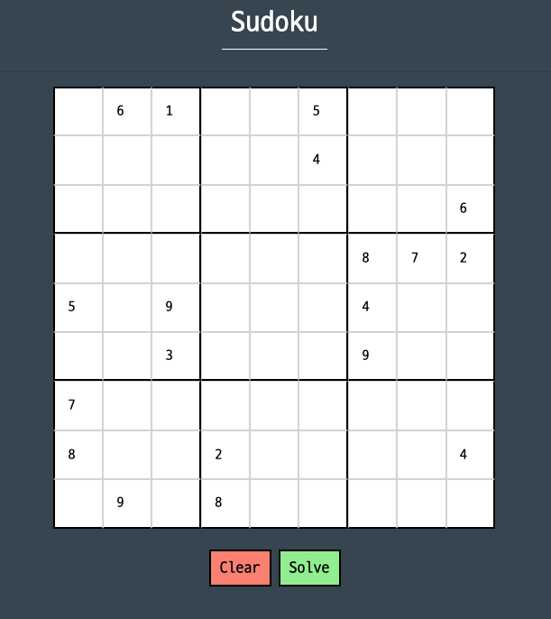
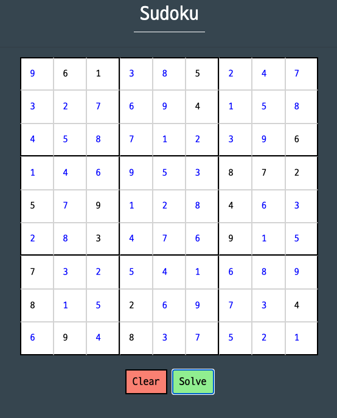

<!-- 로고 -->
- - -

  

### Sudoku Pass
스도쿠 문제를 풀어주는 웹앱

- - -
<!-- TABLE OF CONTENTS -->

  
목차

>### [1. 개요](#개요)
>### [2. 개발 스펙](#개발-스펙)
>### [3. 스크린샷](#스크린샷)
>### [4. 추가예정](#추가예정)

- - -

<!-- 개요 -->
## 개요

스도쿠 문제를 자동으로 풀어주는 웹 앱입니다.

모든 값을 대입해보는 방식으로 풀이하지 않고 아래의 플로우로 풀이를 진행합니다.

1. 확정되어 있는 값을 통해 빈칸에 들어갈 수 있는 "후보지" 를 정한다
2. 단일 후보지를 가지고 있을 경우 값을 채워넣고 후보지 정리를 한다
3. 순환 후보지를 판단하여 유효하지 않은 후보지를 제외한다

직접 스도쿠를 풀어내는 방식을 코드로 구현하였습니다.
- - -
<!-- 개발 스펙 -->
## 개발 스펙

> * Spring Boot ( v2.5.4 )
> * Spring Web ( v2.5.4 )
> * Spring Boot Devtools ( v2.5.4 )
> * Lombok ( v1.18.20 )
> * Mustache ( v2.5.4 )

- - -
<!-- 스크린샷 -->
## 스크린샷

### 스도쿠 문제 입력

### 스도쿠 문제 풀이

<!-- 추가예정 -->
## 추가예정

- 입력된 문제를 해싱하여 풀이와 함께 DB에 저장
- 풀리지 않은 문제가 발생할 경우 문제 저장 및 알림 전송